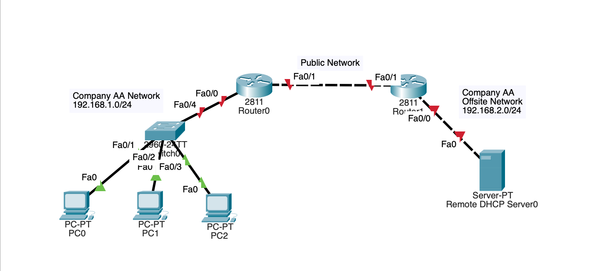
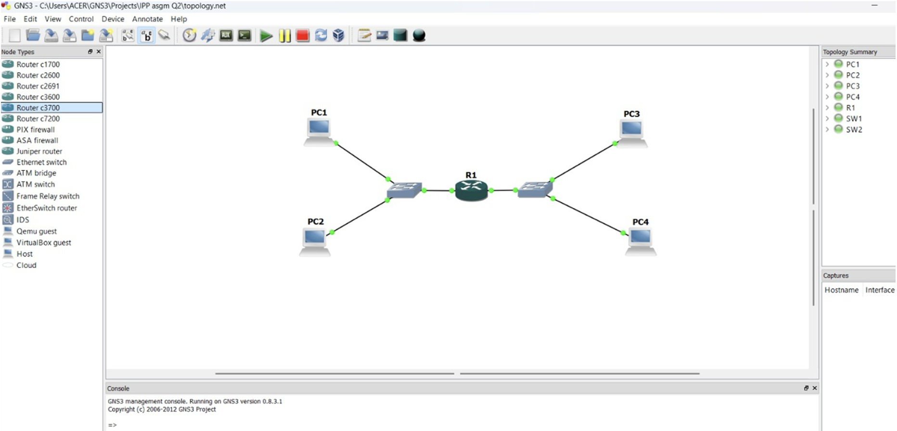

# Advanced Internetworking: DHCP Relay & NAT-PT Protocol Translation

A networking project demonstrating enterprise DHCP Relay deployment, Port Address Translation (PAT), and IPv4-to-IPv6 protocol translation (NAT-PT). The project was implemented using Cisco Packet Tracer and GNS3 to simulate real-world enterprise networking scenarios.

---

## Project Overview

This project consists of two networking implementations:

- **Part 1:** Enterprise DHCP Relay and PAT configuration using Cisco Packet Tracer.
- **Part 2:** IPv4-to-IPv6 communication using Static NAT-PT in GNS3.

The project demonstrates practical knowledge of enterprise routing, dynamic IP allocation, IPv4/IPv6 interoperability, Linux networking, and packet analysis using Wireshark.

---

# Technologies & Tools

### Network Simulation
- Cisco Packet Tracer
- GNS3

### Operating Systems
- Cisco IOS
- QEMU Microcore Linux

### Networking Protocols
- DHCP Relay (`ip helper-address`)
- DHCP
- Port Address Translation (PAT)
- Static NAT-PT
- IPv4
- IPv6
- ICMP / ICMPv6
- Static Routing

### Packet Analysis
- Wireshark

---

# Part 1 – Cisco Packet Tracer

## Objective

Configure an enterprise network where clients automatically obtain IP addresses from a remote DHCP server located on another subnet through DHCP Relay.

## Network Topology

---

## Features Implemented

- DHCP Relay (`ip helper-address`)
- Remote DHCP Server
- Port Address Translation (PAT)
- Static Routing
- Multi-router enterprise topology
- DHCP DORA process validation

---

## Device Configuration

| Device | Configuration |
|---------|---------------|
| PC0 | DHCP Client |
| PC1 | DHCP Client |
| PC2 | DHCP Client |
| Router0 | DHCP Relay, PAT |
| Router1 | PAT |
| Server0 | DHCP Server |

---

## Validation

✔ DHCP clients successfully obtained IP addresses

✔ DHCP Relay forwarded requests across different subnets

✔ PAT enabled outbound connectivity

✔ Routing between enterprise networks verified

---

# Part 2 – GNS3

## Objective

Enable communication between an IPv4-only network and an IPv6-only network using Static NAT-PT.

## Network Topology

---

## Features Implemented

- Static NAT-PT
- IPv4 ↔ IPv6 Translation
- Dual-stack Router
- Linux Network Configuration
- Wireshark Packet Analysis
- ICMP / ICMPv6 Validation

---

## Device Configuration

| Device | Address | Gateway |
|---------|---------|----------|
| PC1 | 192.168.1.1/24 | 192.168.1.254 |
| PC2 | 192.168.1.2/24 | 192.168.1.254 |
| PC3 | 2000::1/64 | 2000::1000 |
| PC4 | 2000::2/64 | 2000::1000 |

Linux hosts were configured using standard Linux networking commands (`ifconfig` and `route`). The complete commands are available in **configs/Linux_Commands.txt**.

---

## Validation

✔ IPv4 hosts successfully communicated with IPv6 hosts

✔ IPv6 hosts successfully communicated with IPv4 hosts

✔ Static NAT-PT mappings verified

✔ ICMP packet translation confirmed

✔ Packet translation analysed using Wireshark

---

# Skills Demonstrated

- Enterprise Network Design
- Cisco Router Configuration
- DHCP Relay Deployment
- Port Address Translation (PAT)
- Static NAT-PT
- IPv4 & IPv6 Networking
- Linux Network Configuration
- Static Routing
- Wireshark Packet Analysis
- Network Troubleshooting

---

# Future Improvements

- Dynamic Routing (OSPF)
- DHCPv6
- IPv6 ACLs
- Firewall Security Policies
- High Availability (HSRP)

---

# Author

**Boon Jia Xuan**

Bachelor of Computer Science (Honours)

Universiti Tunku Abdul Rahman (UTAR)
