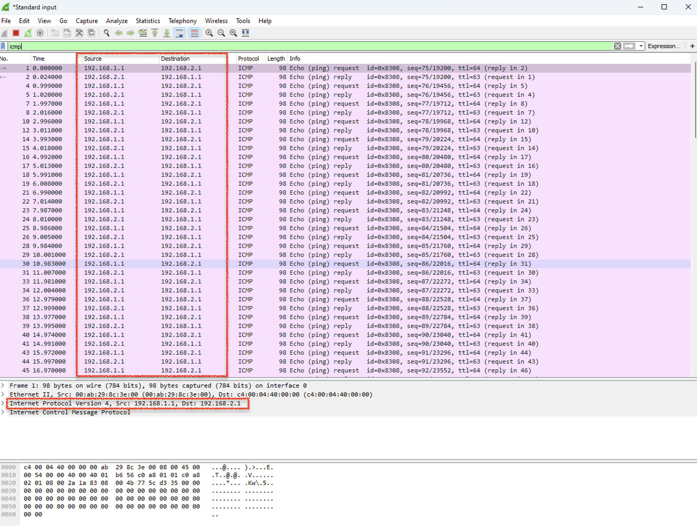
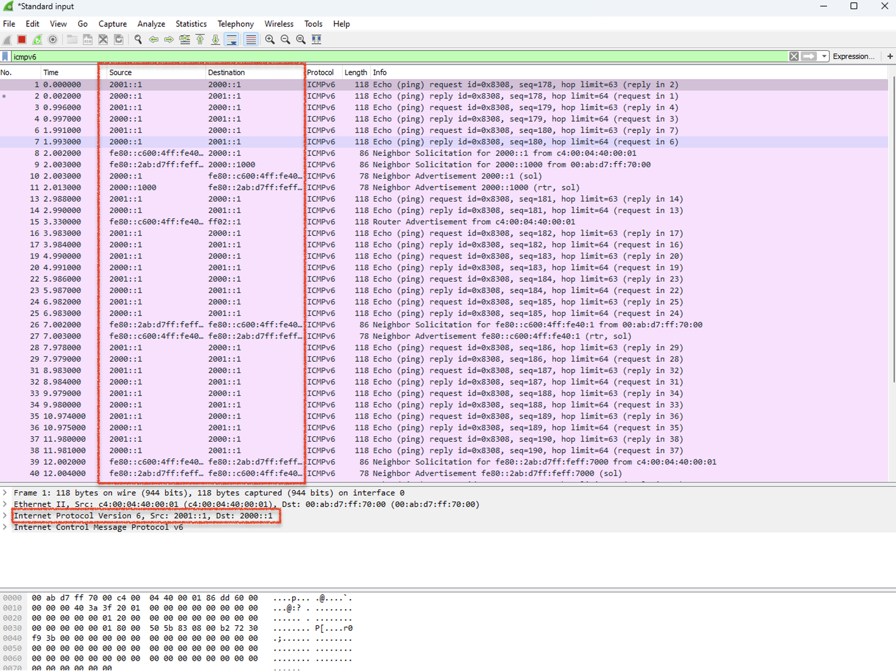

# Advanced Internetworking: DHCP Relay & NAT-PT Protocol Translation 🌐🔄

A networking project demonstrating enterprise DHCP Relay deployment, Port Address Translation (PAT), and IPv4-to-IPv6 protocol translation (NAT-PT). The project was implemented using Cisco Packet Tracer and GNS3 to simulate real-world enterprise networking scenarios.

---

## 📌 Project Overview

This project consists of two networking implementations:

* **Part 1:** Enterprise DHCP Relay and PAT configuration using Cisco Packet Tracer.
* **Part 2:** IPv4-to-IPv6 communication using Static NAT-PT in GNS3.

The project demonstrates practical knowledge of enterprise routing, dynamic IP allocation, IPv4/IPv6 interoperability, Linux networking, and packet analysis using Wireshark.

---

## 🛠️ Technologies & Tools

### 🖥️ Network Simulation
* Cisco Packet Tracer
* GNS3

### 🐧 Operating Systems
* Cisco IOS
* QEMU Microcore Linux

### 📡 Networking Protocols
* DHCP Relay (`ip helper-address`)
* DHCP
* Port Address Translation (PAT)
* Static NAT-PT
* IPv4 & IPv6
* ICMP / ICMPv6
* Static Routing

### 🔎 Packet Analysis
* Wireshark

---

## ⚙️ Part 1 – Cisco Packet Tracer

### 🎯 Objective
Configure an enterprise network where clients automatically obtain IP addresses from a remote DHCP server located on another subnet through DHCP Relay.

### 🗺️ Network Topology

### ✨ Features Implemented
* DHCP Relay (`ip helper-address`)
* Remote DHCP Server
* Port Address Translation (PAT)
* Static Routing
* Multi-router enterprise topology
* DHCP DORA process validation

### 💻 Device Configuration

| Device | Configuration |
| :--- | :--- |
| **PC0** | DHCP Client |
| **PC1** | DHCP Client |
| **PC2** | DHCP Client |
| **Router0** | DHCP Relay, PAT |
| **Router1** | PAT |
| **Server0** | DHCP Server |

### 📊 Validation Results

| Test Case | Description | Status |
| :--- | :--- | :--- |
| **DHCP Relay** | `ip helper-address` successfully forwards requests across subnets to the remote server. | ✅ Passed |
| **IP Assignment** | PC0, PC1, and PC2 receive correct IP configurations via the DHCP DORA process. | ✅ Passed |
| **PAT Translation** | Internal private IPs are successfully translated to the router's public interface IP. | ✅ Passed |

---

## 🔧 Part 2 – GNS3

### 🎯 Objective
Enable communication between an IPv4-only network and an IPv6-only network using Static NAT-PT.

### 🗺️ Network Topology

### ✨ Features Implemented
* Static NAT-PT
* IPv4 ↔ IPv6 Translation
* Dual-stack Router
* Linux Network Configuration
* Wireshark Packet Analysis
* ICMP / ICMPv6 Validation

### 💻 Device Configuration

| Device | Native Address | Target Translated Mapping | Default Gateway |
| :--- | :--- | :--- | :--- |
| **PC1** | `192.168.1.1/24` | `2001::1` | `192.168.1.254` |
| **PC2** | `192.168.1.2/24` | `2001::2` | `192.168.1.254` |
| **PC3** | `2000::1/64` | `192.168.2.1` | `2000::1000` |
| **PC4** | `2000::2/64` | `192.168.2.2` | `2000::1000` |

### 📊 Validation & Protocol Analysis

#### ✅ Connectivity Testing
| Test Case | Description | Status |
| :--- | :--- | :--- |
| **IPv4 → IPv6** | ICMP pings from native IPv4 hosts (e.g., PC1) successfully reach IPv6 hosts. | ✅ Passed |
| **IPv6 → IPv4** | ICMPv6 pings from native IPv6 hosts (e.g., PC3) successfully reach IPv4 hosts. | ✅ Passed |
| **NAT-PT Mapping** | Static bindings correctly translate the `192.168.2.x` network to the `2000::x` network and vice-versa. | ✅ Passed |

### 🔍 Protocol Analysis Evidence (Wireshark)
To verify that the NAT-PT engine is correctly translating the traffic, packets were captured at the boundary router (R1) during an ICMP ping from PC1 to PC3.

**A. Native IPv4 LAN Segment (PC1 ↔ R1)**
Before reaching the translation engine on the gateway router, packets traversing the local link remain entirely inside native IPv4 encapsulations.
* **Capture:** 
* **Header Details:** The packet displays a standard Internet Protocol Version 4 header. The Source is `192.168.1.1` (PC1), and it is routing toward the Destination `192.168.2.1` (the mapped IPv4 representation of PC3).

**B. Translated IPv6 Segment Core (R1 ↔ PC3)**
Upon processing by the NAT-PT engine, the IPv4 headers are completely stripped, converted, and restructured into an IPv6 frame format for delivery across the disparate link.
* **Capture:** 
* **Header Details:** The packet now displays a restructured Internet Protocol Version 6 header. The Source is translated to `2001::1` (the mapped IPv6 representation of PC1), routing straight to the native Destination address `2000::1` (PC3).

---

## 💡 Technical Skills Demonstrated

* **Networking:** Enterprise Network Design, IPv4 & IPv6 Networking, Static Routing
* **Cisco Technologies:** DHCP Relay, PAT, NAT-PT
* **System Administration:** Linux Network Configuration
* **Analysis:** Wireshark Packet Analysis, Network Troubleshooting

---

## 📂 Documentation

A detailed technical report describing the implementation, router configurations, protocol analysis, and experimental results is available in:
* [📥 Advanced Internetworking Report (PDF)](report/Advanced_Internetworking_Report.pdf)

---

## 🚀 Future Improvements

* Dynamic Routing (OSPF)
* DHCPv6
* IPv6 ACLs
* Firewall Security Policies
* High Availability (HSRP)

---

## 🧑‍💻 Author

**Boon Jia Xuan** Bachelor of Computer Science (Honours)  
Universiti Tunku Abdul Rahman (UTAR)
